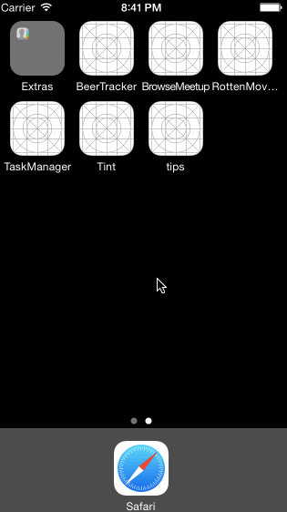

## Synopsis

This is the code for the Week 1 Project: Rotten Tomatoes for iOS CodePath 

## Number of hours spent

I spent about 11 hours implementing all the required features and some of the optionals

## Features (required and optional)

* User can view a list of movies from Rotten Tomatoes. Poster images must be loading asynchronously.
* User can view movie details by tapping on a cell
* User sees loading state while waiting for movies API. You can use one of the 3rd party libraries at cocoacontrols.com.
* User sees error message when there's a networking error. You may not use UIAlertView to display the error. 
* User can pull to refresh the movie list.
* All images fade in (optional)
* For the large poster, load the low-res image first, switch to high-res when complete (optional)
* Customize the navigation bar. (optional)
* The app was only tested on iphone 4 and iphone 5. The table sizing is not looking correct on iphone 6. Need to use auto layout

## Installation
The pods directory was also checked in so theoretically should just need to load RottenMovieController.xcworkspace

## Third party libraries used

* AFNetworking (for asynchronous loading of images)
* RNActivityView (for showing the loading dialog)
* CSNotificationView (for displaying networking error)

## Animated gif walkthrough

GIF created with [LiceCap](http://www.cockos.com/licecap/).

